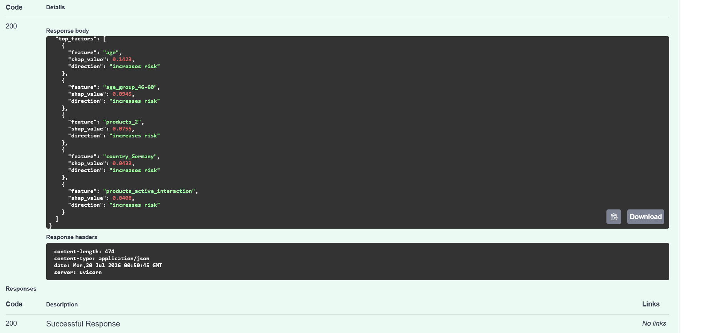

# Customer Churn Prediction

A complete, end-to-end machine learning project predicting which bank customers are likely to churn from raw data through a tuned, evaluated model.

## Project Overview

Banks lose money every time a customer leaves, and it's far cheaper to retain an existing customer than acquire a new one. This project builds a classification model that flags customers likely to churn, so retention efforts can be targeted at the right people before they leave.

**Dataset:** 10,000 bank customers, 11 raw features (demographics, account details, product usage), with a binary churn label (~20% churn rate).

## Workflow

```
01_data_understanding.ipynb   → Raw data inspected
02_data_cleaning.ipynb        → bank_customer_churn_clean.csv
03_exploratory_data_analysis  → Visualizations + insights
04_feature_engineering.ipynb  → bank_customer_churn_features(_scaled).csv
05_model_training.ipynb       → trained_model.pkl
06_model_evaluation.ipynb     → Tuned threshold + performance report
07_model_interpretation.ipynb → SHAP explanations + business recommendations
```

Each notebook builds directly on the last, findings from earlier steps are explicitly used to justify decisions in later ones (see below).

## Key Findings by Stage

### EDA (03_exploratory_data_analysis.ipynb)
- **Age** is the strongest single correlate of churn (r ≈ 0.29), older customers churn more.
- **Active membership** matters (r ≈ -0.16), active members churn far less.
- **Products number** has a **non-monotonic (U-shaped)** relationship with churn: customers with 2 products retain best, customers with 3-4 products churn at very high rates (~85-100%). This finding directly shaped the feature engineering approach below.
- **Country** and **gender** show meaningful group differences (Germany churns highest; females churn more than males) and were retained as categorical features.
- **Credit score, tenure, and estimated salary** show weak individual correlation with churn (|r| ≤ 0.03).

### Feature Engineering (04_feature_engineering.ipynb)
- products_number was **one-hot encoded** rather than left as a raw number, since the EDA showed the relationship isn't linear, a model treating it as a plain number would wrongly assume a straight-line effect.
- Five new features were engineered based on EDA patterns: is_zero_balance, balance_to_salary_ratio, age_group (binned), tenure_by_age, and products_active_interaction.
- Both a **scaled** and **unscaled** version of the feature set were saved, since it wasn't yet clear which model type would perform best.

### Model Training (05_model_training.ipynb)
- Three models were compared under identical stratified cross-validation: **Logistic Regression**, **Random Forest**, and **XGBoost**.
- Random Forest had the highest test-set ROC-AUC (0.853), but its **default 0.5 threshold only caught 45% of actual churners** a meaningful gap given that missing a churner is the costlier business mistake.
- This flagged the need for threshold tuning before treating any model as "final" & ROC-AUC alone doesn't guarantee a good decision threshold.

### Model Evaluation (06_model_evaluation.ipynb)
- **Threshold tuning:** lowering Random Forest's decision threshold from 0.5 to **0.247** raised churn recall from 45% to **70%** (285 of 407 churners caught, up from 185), while F1 also improved slightly (0.57 → 0.59), not just a trade-off, but a net improvement by the model's own combined metric.
- **Permutation importance** confirmed the EDA's original findings almost exactly: products_2, age, country_Germany, and balance are the strongest drivers, while credit_score and estimated_salary are confirmed irrelevant (near-zero importance) correcting Random Forest's default impurity-based importance, which had misleadingly ranked those same weak features high.
- **New finding:** tenure and tenure_by_age showed *negative* permutation importance, suggesting they add noise rather than signal, a candidate for removal in a future iteration.

### Model Interpretation (07_model_interpretation.ipynb)
- **SHAP values** confirmed the direction of each feature's effect, not just its magnitude e.g. showing that holding exactly 2 products actively *lowers* churn risk, while 1 product (or 3-4) raises it, and that increasing age consistently pushes predictions toward churn.
- Individual, per-customer SHAP waterfall plots demonstrate that specific predictions can be explained in plain terms useful for a retention team needing to justify why a given customer was flagged.
- Findings were translated into 6 concrete business recommendations (e.g. targeted cross-sell for single-product customers, a dedicated service review for the small but high-risk 3-4 product segment, and geography-specific investigation into Germany's elevated churn).
- Limitations were documented explicitly, including the lack of real cost data behind the threshold choice, no temporal validation, small subgroup sizes for the 3-4 product segment, and the fact that SHAP/permutation importance show association with the model's behavior, not proven real-world causation.
- **Note on probability calibration:** because the model was trained with class_weight="balanced", its raw predicted probabilities are shifted well above the dataset's true ~20% churn rate (SHAP's baseline sits at 0.5, not 0.20) reinforcing that probability outputs should be calibrated (e.g. CalibratedClassifierCV) before being used for anything beyond ranking.

## Final Model

| | Value |
|---|---|
| Model | Random Forest Classifier |
| ROC-AUC | 0.853 |
| Average Precision | 0.676 |
| Decision threshold used | 0.247 (tuned; default is 0.5) |
| Precision (churn class) | 0.50 |
| Recall (churn class) | 0.70 |
| F1 (churn class) | 0.59 |

**Deployment note:** this model's decision threshold was deliberately tuned away from scikit-learn's 0.5 default to prioritize catching churners. Any code using trained_model.pkl must apply the **0.247 threshold to .predict_proba()** output manually, calling .predict() directly will silently revert to 0.5 and under-catch churners.

## Repository Structure

```
Customer-churn-prediction/
├── README.md
├── requirements.txt
├── LICENSE
├── .gitignore
├── data/
│   ├── raw/                          # Original dataset
│   └── processed/                    # Cleaned & engineered CSVs
├── models/
│   └── trained_model.pkl             # Model as saved during 05_model_training.ipynb
├── images/                           # Charts saved from each notebook
├── reports/
│   └── model_evaluation_summary.json # Metrics at default & tuned threshold (from 06)
├── notebooks/
│   ├── 01_data_understanding.ipynb
│   ├── 02_data_cleaning.ipynb
│   ├── 03_exploratory_data_analysis.ipynb
│   ├── 04_feature_engineering.ipynb
│   ├── 05_model_training.ipynb
│   ├── 06_model_evaluation.ipynb
│   └── 07_model_interpretation.ipynb
├── src/
│   └── generate_final_artifacts.py   # Standalone script producing results/ below
└── results/
    ├── best_model.pkl                # Final model, copied for easy access
    ├── metrics.csv                   # Final metrics at the tuned decision threshold
    ├── confusion_matrix.png
    ├── roc_curve.png
    └── feature_importance.png        # Permutation importance (not impurity-based)
```


## Possible Next Steps

- Drop tenure and tenure_by_age, which showed negative permutation importance, and re-evaluate whether this simplifies the model without hurting performance.
- Gather real retention-campaign cost data to decide definitively between the recall-focused threshold (0.247) and the balanced best-F1 threshold (0.357) used in this project.
- Try SHAP values for a more granular, per-prediction explanation than global permutation importance offers.
- Test whether an age x active_member interaction feature (not currently engineered) adds predictive value, following the same logic used for products_active_interaction.


## API Deployment

This project includes a FastAPI service that serves the trained model as a real-time REST API, containerized with Docker for portable deployment.


### Endpoints
| Endpoint | Method | Description |
|---|---|---|
| /health | GET | Liveness check |
| /predict | POST | Returns churn probability, prediction, and risk tier (low/medium/high), using the tuned 0.247 decision threshold rather than scikit-learn's default 0.5 |
| /explain | POST | Same as /predict, plus the top 5 SHAP factors driving that specific customer's score |

### Example response screenshot

The /explain endpoint returns not just a prediction, but the specific factors driving it for that customer which is useful for a retention team that needs to justify why someone was flagged:



**Live deployment:** http://107.21.197.14:8080 - try `/docs` for the interactive API explorer